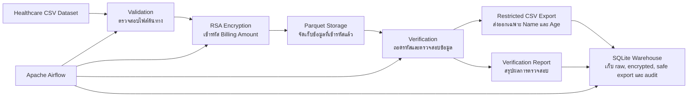

# End-to-End Encrypted Data Pipeline

โปรเจกต์นี้เป็นโปรเจกต์ Data Engineering แบบ End-to-End ที่จำลองการจัดการข้อมูลสุขภาพอย่างปลอดภัย โดย pipeline จะอ่านข้อมูลจากไฟล์ CSV, เข้ารหัสข้อมูลที่มีความอ่อนไหว, จัดเก็บข้อมูลในรูปแบบ Parquet, ตรวจสอบความถูกต้องของข้อมูลหลังถอดรหัส, export เฉพาะข้อมูลที่ปลอดภัย และโหลดผลลัพธ์เข้า SQLite เพื่อให้สามารถ query และตรวจสอบย้อนหลังได้

---

# สรุปโปรเจกต์

โปรเจกต์นี้ออกแบบมาเพื่อใช้เป็นผลงานใน GitHub, Resume และใช้เล่าใน Technical Interview ได้ โดยแสดงให้เห็นว่า Data Engineer สามารถ:

- รับข้อมูลจาก source file
- ตรวจสอบความพร้อมของข้อมูลก่อนเริ่ม pipeline
- เข้ารหัสข้อมูลที่มีความอ่อนไหว
- แปลงและจัดเก็บข้อมูลในรูปแบบ Parquet
- ตรวจสอบว่าข้อมูลหลังถอดรหัสยังถูกต้องตรงกับต้นฉบับ
- export เฉพาะข้อมูลที่สามารถนำไปใช้งานต่อได้อย่างปลอดภัย
- โหลดข้อมูลที่ผ่านการประมวลผลเข้า warehouse
- orchestrate workflow ทั้งหมดด้วย Airflow
- รันระบบใน local environment ด้วย Docker

---

# โปรเจกต์นี้ทำอะไร

โปรเจกต์นี้จำลองการประมวลผลข้อมูลสุขภาพ โดยมี field สำคัญที่ต้องปกป้องคือ `Billing Amount`

ลำดับการทำงานของ pipeline มีดังนี้:

1. อ่านข้อมูลจากไฟล์ `healthcare_dataset.csv`
2. ตรวจสอบว่า source file มีอยู่จริง
3. เข้ารหัสคอลัมน์ `Billing Amount` ด้วย RSA
4. บันทึกข้อมูลที่เข้ารหัสแล้วเป็นไฟล์ Parquet
5. อ่านไฟล์ Parquet กลับมาและถอดรหัสเพื่อตรวจสอบความถูกต้อง
6. เปรียบเทียบค่าที่ถอดรหัสได้กับข้อมูลต้นฉบับ
7. export เฉพาะข้อมูลที่ปลอดภัย เช่น `Name` และ `Age`
8. สร้าง verification report สำหรับตรวจสอบผลการทำงาน
9. โหลดข้อมูล raw, encrypted, safe export และ audit log เข้า SQLite warehouse

---

# ใช้ทำอะไรได้บ้าง

โปรเจกต์นี้เหมาะสำหรับอธิบายแนวคิดการทำ Secure Data Pipeline เช่น:

- การปกป้องข้อมูลสำคัญระหว่างการประมวลผล
- การจัดเก็บข้อมูลในรูปแบบที่เหมาะกับงาน data engineering
- การตรวจสอบความถูกต้องของข้อมูลก่อนส่งต่อ
- การเก็บ audit trail เพื่อให้ตรวจสอบย้อนหลังได้
- การทำให้ข้อมูลที่ผ่าน pipeline แล้วพร้อม query ต่อได้ใน warehouse

---

# Architecture



---

# Airflow Pipeline

โปรเจกต์นี้ใช้ Apache Airflow ในการจัดลำดับการทำงานของ pipeline โดย DAG จะทำงานตามขั้นตอนดังนี้:

- `validate_source_csv`
- `encrypt_csv_to_parquet`
- `decrypt_verify_and_export_csv`
- `load_to_sqlite_warehouse`

---

# Airflow DAG Run

สามารถเพิ่มภาพ Airflow DAG ที่รันสำเร็จไว้ในโฟลเดอร์ `assets` และแสดงใน README ได้ เช่น:

```md


```


---

# การไหลของข้อมูล

## Source Layer

- `healthcare_dataset.csv`

## Encrypted Processing Layer

- ข้อมูล `Billing Amount` ถูกเข้ารหัส
- จัดเก็บข้อมูลในรูปแบบ Parquet

## Safe Delivery Layer

- export เฉพาะข้อมูลที่ปลอดภัย
- สร้างรายงานตรวจสอบผลการทำงาน

## Warehouse Layer

ข้อมูลจะถูกโหลดเข้า SQLite เป็น 4 ตารางหลัก:

- `raw_healthcare`
- `encrypted_healthcare`
- `safe_export`
- `verification_audit`

---

# Tech Stack

- Python
- Apache Airflow
- PyArrow
- Cryptography
- SQLite
- Docker Compose
- Parquet

---

# โครงสร้างโปรเจกต์

```text
.
├── assets/                     # รูปภาพและ diagram
├── dags/                       # Airflow DAG
├── pipeline/                   # ETL logic และ warehouse load
├── docker-compose.yml          # รัน environment แบบ local
├── Dockerfile.airflow          # Docker image สำหรับ Airflow
├── healthcare_dataset.csv      # ข้อมูลต้นทาง
└── requirements-airflow.txt    # dependencies
```

---

# เครื่องมือแต่ละตัวใช้ทำอะไร

## Python

ใช้สำหรับเขียน ETL logic ทั้งหมด เช่น ตรวจสอบ source file, ควบคุมการเข้ารหัส, ถอดรหัส, export ข้อมูล และโหลดข้อมูลเข้า SQLite

## Apache Airflow

ใช้สำหรับ orchestrate pipeline หรือจัดลำดับงานในแต่ละขั้นตอน ทำให้เห็น workflow ชัดเจนและตรวจสอบการรันงานได้ง่าย

## Cryptography

ใช้สำหรับเข้ารหัสและถอดรหัสข้อมูลในคอลัมน์ `Billing Amount` ด้วย RSA เพื่อป้องกันข้อมูลที่มีความอ่อนไหว

## PyArrow และ Parquet

ใช้สำหรับแปลงและจัดเก็บข้อมูลที่เข้ารหัสแล้วให้อยู่ในรูปแบบ Parquet ซึ่งเหมาะกับงาน data engineering และ downstream processing

## SQLite

ใช้เป็น warehouse layer แบบง่าย ๆ สำหรับเก็บข้อมูลที่ผ่าน pipeline แล้วในรูปแบบที่ query ได้ เช่น raw data, encrypted data, safe export และ audit log

## คำสั่งสำหรับเช็กข้อมูลข้างใน SQLite Warehouse

หลังจาก pipeline รันสำเร็จแล้ว สามารถใช้คำสั่งเหล่านี้เพื่อตรวจสอบข้อมูลใน `warehouse/healthcare_pipeline.db` ได้

## 1. เช็กว่าไฟล์ฐานข้อมูลถูกสร้างแล้ว

## 1. เช็กว่าไฟล์ฐานข้อมูลถูกสร้างแล้ว

## 3. ดูข้อมูลจากตาราง raw_healthcare

## 4. ดูข้อมูลจากตาราง encrypted_healthcare

## 5. ดูข้อมูลจากตาราง verification_audit


## Docker Compose

ใช้สำหรับสร้าง local environment ที่สามารถรันซ้ำได้ง่าย และช่วยให้ setup โปรเจกต์ได้สะดวก

---

# วิธีรันโปรเจกต์ในเครื่อง

## 1. เริ่ม Airflow

```bash
docker compose up --build airflow-init
docker compose up --build
```

---

## 2. เปิด Airflow

เข้าไปที่:

```text
http://localhost:8081
```

### Login

```text
Username: admin
Password: admin
```

---

## 3. Trigger DAG

เลือก DAG `healthcare_csv_parquet_export` แล้วกดรันจากหน้า Airflow UI

---

# Output ที่ได้หลังรันสำเร็จ

หลังจาก pipeline รันเสร็จ จะมี output ดังนี้:

```text
processed_parquet/healthcare_encrypted.parquet
exports/name_age_export.csv
exports/verification_report.json
warehouse/healthcare_pipeline.db
```

ใน SQLite database จะมีตาราง:

- `raw_healthcare`
- `encrypted_healthcare`
- `safe_export`
- `verification_audit`

---

# จุดเด่นของโปรเจกต์นี้

โปรเจกต์นี้ไม่ได้เป็นแค่การแปลงไฟล์ธรรมดา แต่แสดงแนวคิดสำคัญของงาน Data Engineering ได้ชัดเจน เช่น:

- การจัดการข้อมูลที่มีความอ่อนไหว
- การตรวจสอบคุณภาพและความถูกต้องของข้อมูล
- การจัดเก็บข้อมูลในรูปแบบที่เหมาะกับ pipeline
- การสร้าง warehouse layer เพื่อให้ query ได้
- การเก็บ audit trail สำหรับตรวจสอบย้อนหลัง
- การ orchestrate workflow แบบเป็นระบบ

---

# Future Improvements

- เปลี่ยนจาก SQLite ไปใช้ PostgreSQL
- เพิ่ม data quality checks เช่น null check และ duplicate check
- เพิ่ม dbt model สำหรับ downstream analytics
- เพิ่ม CI/CD สำหรับทดสอบ pipeline อัตโนมัติ
- เพิ่ม dashboard หรือ SQL examples สำหรับการวิเคราะห์ข้อมูล
- เพิ่มแนวคิด external key management แทน local key generation

