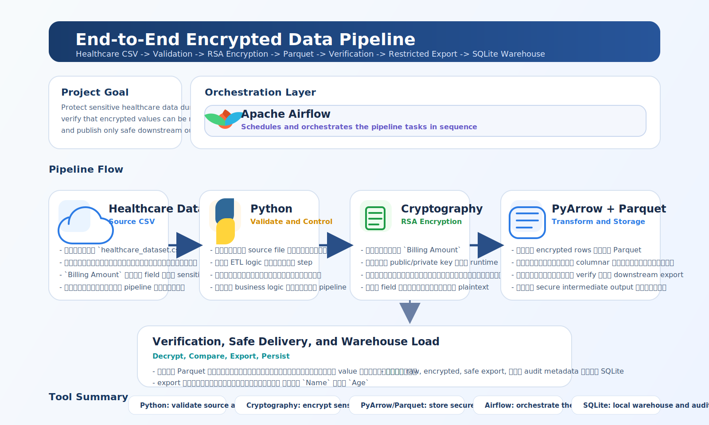

# End-to-End Encrypted Data Pipeline

This project demonstrates a local end-to-end data engineering pipeline that ingests a healthcare CSV file, encrypts a sensitive column, stores the result as Parquet, verifies decryption integrity, exports a restricted downstream dataset, and loads curated outputs into a SQLite warehouse for querying and auditability.

## What the Project Does

The pipeline processes a healthcare-style dataset and protects a sensitive financial field during transformation while still producing safe, queryable outputs.

Pipeline flow:

1. Validate that the source CSV exists.
2. Encrypt the `Billing Amount` column with RSA.
3. Store the transformed dataset in Parquet format.
4. Read the encrypted Parquet file and decrypt the sensitive values.
5. Verify decrypted values against the original CSV.
6. Export a limited CSV containing only `Name` and `Age`.
7. Generate a verification report in JSON.
8. Load raw, encrypted, safe export, and audit metadata into a SQLite warehouse.

## Architecture



## Airflow DAG

The orchestration DAG is `healthcare_csv_parquet_export` and runs these tasks:

- `validate_source_csv`
- `encrypt_csv_to_parquet`
- `decrypt_verify_and_export_csv`
- `load_to_sqlite_warehouse`

## Tech Stack

- Python
- Apache Airflow
- Docker Compose
- PyArrow
- Cryptography
- Parquet
- SQLite

## Repository Structure

```text
.
+-- assets/
|   \-- pipeline-architecture.svg
+-- dags/
|   \-- healthcare_pipeline_dag.py
+-- pipeline/
|   \-- healthcare_etl.py
+-- docker-compose.yml
+-- Dockerfile.airflow
+-- healthcare_dataset.csv
\-- requirements-airflow.txt
```

## Data Flow and Tool Responsibilities

### Healthcare Dataset

`healthcare_dataset.csv` is the source dataset. It contains patient and billing-related fields used to simulate a healthcare data pipeline with a sensitive column.

### Python

Python implements the ETL logic:

- validates the input file
- prepares source rows
- controls encryption, verification, export, and warehouse load

### Cryptography

The `cryptography` library is used to:

- generate RSA keys locally at runtime when needed
- encrypt `Billing Amount`
- decrypt the encrypted values for verification

### PyArrow and Parquet

PyArrow is used to write and read Parquet files:

- stores encrypted records in a columnar format
- provides an efficient intermediate dataset for downstream processing

### SQLite

SQLite acts as the local warehouse layer:

- `raw_healthcare` stores source records
- `encrypted_healthcare` stores transformed encrypted rows
- `safe_export` stores the restricted downstream dataset
- `verification_audit` stores run metadata for audit and traceability

### Apache Airflow

Airflow orchestrates the task sequence and gives the project:

- workflow visibility
- repeatable execution
- local orchestration through the Airflow UI

### Docker

Docker Compose provides a reproducible local environment for Airflow and the supporting pipeline code.

## SQLite Warehouse Design

The warehouse database is generated locally at runtime:

- `warehouse/healthcare_pipeline.db`

Tables created by the pipeline:

- `raw_healthcare`
- `encrypted_healthcare`
- `safe_export`
- `verification_audit`

This makes the project stronger from a data engineering perspective because the pipeline no longer ends at files only. It now publishes queryable outputs and keeps an audit trail.

## Local Run

Start Airflow:

```powershell
docker compose up --build airflow-init
docker compose up --build
```

Open Airflow at:

`http://localhost:8081`

Login:

- Username: `admin`
- Password: `admin`

Then trigger the DAG `healthcare_csv_parquet_export`.

## Output Artifacts

Generated locally during runtime:

- `processed_parquet/healthcare_encrypted.parquet`
- `exports/name_age_export.csv`
- `exports/verification_report.json`
- `warehouse/healthcare_pipeline.db`

These generated files are intentionally excluded from GitHub.

## Example Query Use Cases

Once the DAG finishes, the SQLite warehouse can be used to:

- inspect the raw source data
- verify that encrypted records were loaded successfully
- query the restricted export dataset
- review audit history from `verification_audit`

## Security Note

This repository does not include generated RSA key files. The pipeline creates key material locally at runtime if keys do not already exist. This keeps the repository safer and avoids publishing private cryptographic assets.

## Resume Value

This project demonstrates:

- orchestration of a multi-step ETL workflow with Airflow
- selective encryption of sensitive data fields
- Parquet-based storage for efficient downstream processing
- validation and verification before publishing outputs
- a SQLite warehouse layer for queryable curated data
- reproducible local execution with Docker

